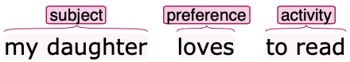

This project is part of a larger investigation focused on detecting privacy leaks in a human-written text in social media. In this case, we aim to detect preferences and things that a person does or likes, using text conversations of the subject. The repository presents :

* Annotated dataset
* ML models to recognize defined Entities

Although below is a little more context, the project is still a bunch of investigation notes and tests. If you wish to know more about the investigation feel free to contact the author.

## Dataset

Text data was taken from  [**Topical-chats**](https://github.com/alexa/Topical-Chat). The conversations there, are very similar to the style of social-networks such as Reddit.
The sentences were annotated using the web tool [**Webanno**](https://webanno.github.io/webanno/) and the below Schema

### Annotation Scheme

1. Subject
2. Preference
3. Activity
4. Object

**Examples**: 

 

## Data Processing

Various steps for cleaning, organizing, and formatting data  were made and can be found in scripts and corpus_porcess file

## Models

1. The first approach is [CRF](https://en.wikipedia.org/wiki/Conditional_random_field) that serve as a baseline model at an Entity level evaluation
2. The second approach is a model based on fine-tuning [BERT](https://en.wikipedia.org/wiki/BERT_(language_model)) pre-trained. The results of this model are very promising and can be found in the logs folder 
